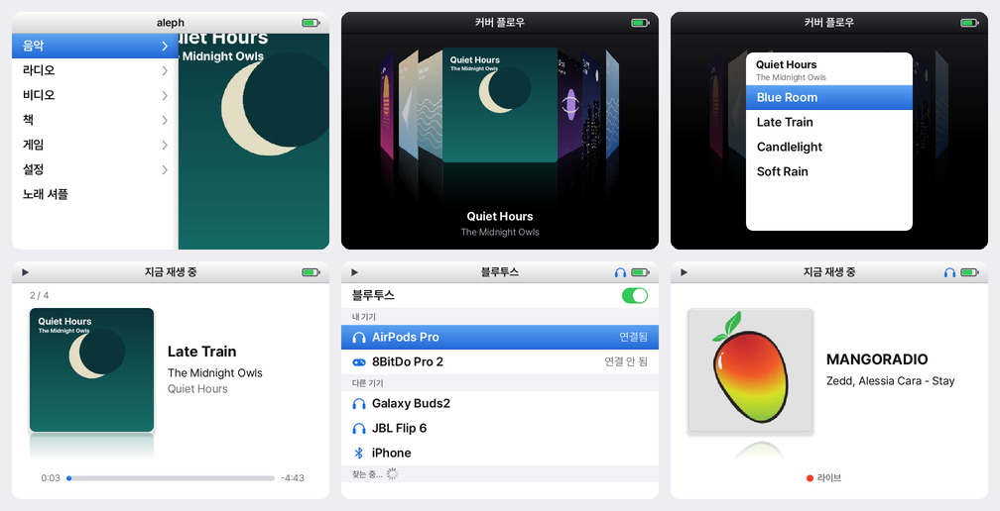

# aleph

A music-first operating system for the Anbernic RG35XX SP, in the spirit of the iPod video.
aleph keeps ROCKNIX's kernel, drivers, bootloader and build system as they are, and
replaces the front end with a small shell built around your music.



## What you get

- **Music** from `/storage/music`: Cover Flow, Playlists, Artists, Albums, Songs, Genres,
  Up Next and Search. Playback carries on in the background, whatever else is open, and a
  sleep timer in Now Playing stops it for you.
- **Search** with an on-screen keyboard that types Hangul as well as Latin; bare initials
  such as ㅎㄱ find 한강.
- **Radio**: stations from [Radio Browser](https://www.radio-browser.info), with
  Favorites, Top Stations, Korea, By Country and Search.
- **Videos** from `/storage/videos`, played by mpv. It remembers where you stopped.
- **Books** from `/storage/books`, opened in KOReader.
- **Games**: PortMaster and the ports it installs.
- **Bluetooth** headphones connect from one list, in Settings or the Control Center. If
  they drop, the music pauses instead of carrying on through the speaker.
- **Wi-Fi** remembers every network you join.
- **Multitasking**: each app keeps its place. Home pauses it where it is, and the home
  screen lists it so you can pick it up again. Up to three apps stay open; when memory
  runs low, the one used longest ago closes first and gets the chance to save.
- **Lid and power**: closing the lid turns the screen off and keeps the music playing,
  and the app in front pauses until the lid opens. With nothing playing the device
  sleeps, and opening the lid wakes it. Videos keep the screen on while they play.

## The look

The last iPod classic, brought forward. Menus split in two: the list on the left, and on
the right a panel where album art drifts slowly across, or the song playing, or a colour and
a glyph for the section you are on. Cover Flow turns the albums in 3D over a black floor
with their reflections; press A and the album flips over to show its songs. Artwork has
softly rounded corners, and type is set in Pretendard.

## The rules

Every screen is a list, and every list works the same way.

| Button | What it does |
| --- | --- |
| D-pad | Move. In long lists ← and → jump to the previous or next letter; in Cover Flow they turn the albums |
| A | Open or choose |
| B | Back |
| X | Options for the selected item |
| Y | Now Playing |
| Start | Play or pause |
| Select | Control Center |
| L1 / R1 | Previous or next track |
| L2 / R2 | Page up or down |
| Home | Home screen; from an app, pause the app and come home |
| Volume | Volume, always |
| Power | Turn the screen off or on; hold for Sleep, Restart and Shut Down |

In Now Playing, ← and → skip 10 seconds and ↑ and ↓ change the volume.

Apps get the buttons while they are in front, except Home and Volume. They follow the
same idea:

- **KOReader**: A selects, B leaves the book (the page is saved), X or Start opens the
  menu, and the shoulders and triggers turn pages.
- **mpv**: A pauses, B leaves and remembers the spot, ← and → skip 10 seconds, ↑ and ↓
  skip a minute, and L1 and R1 move between chapters.

## How it fits together

| Part | Where | Role |
| --- | --- | --- |
| alephd | `aleph/daemon` | Python asyncio daemon. Owns the buttons, the lid and the power key. Runs audio routing, Bluetooth, Wi-Fi, the MPD client and apps, and describes every screen |
| aleph-shell | `aleph/shell` | C and SDL2 renderer at 640×480. Draws what alephd describes and nothing else |
| MPD | `projects/ROCKNIX/packages/aleph/mpd` | Plays music and radio through PipeWire |
| sway | ROCKNIX | Shows the shell on workspace 1 and each app on a workspace of its own |
| systemd | ROCKNIX | Runs each app as a transient unit, frozen while it waits in the background |

The recipes that put these in the image are in `projects/ROCKNIX/packages/aleph`.

## Install on an RG35XX SP

1. Download `aleph-H700-images` from the latest
   [workflow run](https://github.com/hypulse/aleph/actions/workflows/aleph-h700.yml).
   Pick the `DDR4` image for boards with LPDDR4 memory and the `DDR3` image for the rest.
2. Write the `.img.gz` to a microSD card with balenaEtcher or Raspberry Pi Imager.
3. On the card's `ALEPH` partition, copy `device_trees/sun50i-h700-anbernic-rg35xx-sp.dtb`
   to the root of the partition and rename it `dtb.img`.
4. Add music, videos and books either way:
   - **Over Wi-Fi**: open Settings > Add Files over Wi-Fi, then open the address it shows
     in a browser on the same network, enter the code and drop files or folders. Each file
     goes to Music, Videos or Books by its type.
   - **On a second microSD card** (exFAT works with any computer): put them in `music`,
     `videos` and `books` folders. aleph creates the folders on first boot and shows the
     card as an `SD Card` folder in each library.

## Build

The image builds the same way ROCKNIX does, in its build container. aleph ships no 32-bit
userland, so only the aarch64 pass is needed:

```sh
docker run --rm -it --init -v "$PWD":"$PWD" -w "$PWD" --user "$(id -u):$(id -g)" \
    ghcr.io/rocknix/rocknix-build:latest \
    bash -c "PROJECT=ROCKNIX DEVICE=H700 ARCH=aarch64 ./scripts/build_distro"
```

Pushes to the `demo` branch are built by `.github/workflows/aleph-h700.yml`.

## Try it without the device

The simulator runs MPD, alephd with simulated hardware and the shell offscreen, and saves
screenshots along a scripted walk. Set `ALEPH_RECORD=/out/demo.mp4` and run
`aleph/tools/sim/demo.txt` to record the whole system as a captioned video.

```sh
docker build -t aleph-dev aleph/tools/dev
docker run --rm -v "$PWD":/src -v "$PWD/shots":/out -w /src aleph-dev \
    aleph/tools/sim/run.sh /src/aleph/tools/sim/tour.txt /out
```

Daemon tests: `python3 -m unittest discover -s aleph/daemon/tests`.

## Status

This is a demo. The shell, pages and the MPD client are exercised in the simulator. The
parts that talk to the hardware, BlueZ, NetworkManager, PipeWire, evdev, sway and suspend,
still need a pass on the device.

## Credits

aleph is built on [ROCKNIX](https://github.com/ROCKNIX/distribution) and uses
[MPD](https://www.musicpd.org), [KOReader](https://koreader.rocks),
[PortMaster](https://portmaster.games), [mpv](https://mpv.io),
[cJSON](https://github.com/DaveGamble/cJSON) and the
[Pretendard](https://github.com/orioncactus/pretendard) typeface.
